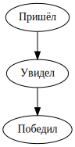

********************************
Пример простейшего графа списка
********************************

Вывод списка в виде графа:
 - Пришёл
 - Увидел
 - Победил

Запуск
======
.. code:: bash

    $ python3 example.py

Результат
=========

