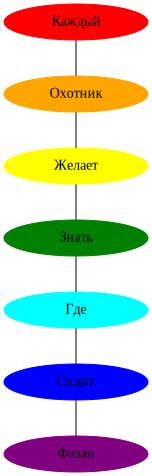

********************************
Пример графа списка со стилями
********************************

Вывод списка в виде графа:
 - Каждый
 - Охотник
 - Желает
 - Знать
 - Где
 - Сидит
 - Фазан

Запуск
======
.. code:: bash

    $ python3 example.py

Результат
=========

