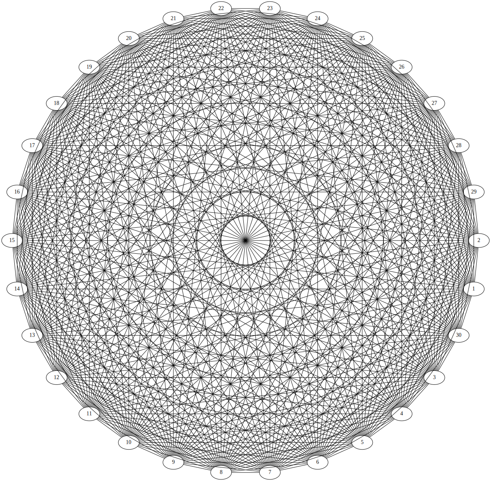

********************************
Рендер полного графа
********************************
``В данном случае граф считается полным,
если каждый его узел имеет связь с любым **другим**
узлом графа.``

Также тут демонстрируется движок построения 
графа **circo**

Запуск
======
.. code:: bash

    $ python3 example.py
    $ >>> Enter edge count: 30

Результат
=========
Для 30 узлов:
