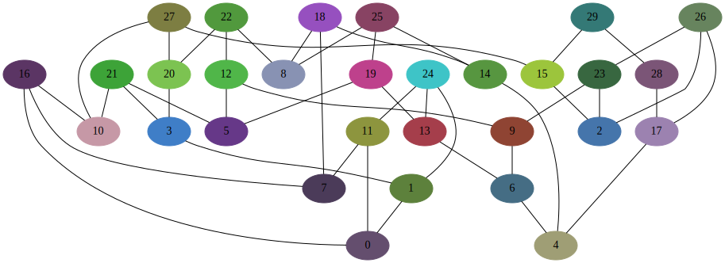

********************************
Генерация случайного графа
********************************
Код генерирует случайный граф, 
с заданный количеством узлов и их степенью.

Запуск
======
.. code:: bash

    $ python3 example.py
    $ >>> Enter edge count: 30

Результат
=========
Для 30 узлов:

example.py
==========

.. automodule:: trac_ticket
   :members:
   :undoc-members: