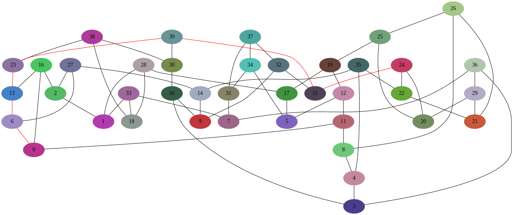

******************
Алгоритм Дейкстры
******************
В данной программы генерируется случайный граф,
потом запускается алгоритм Дейкстры от вершины 0,
после этого визуализируется весь граф и путь от
вершины **0** до вершины графа с **наибольшим**
номером.

Запуск
======
.. code:: bash

    $ python3 example.py

Результат
=========

